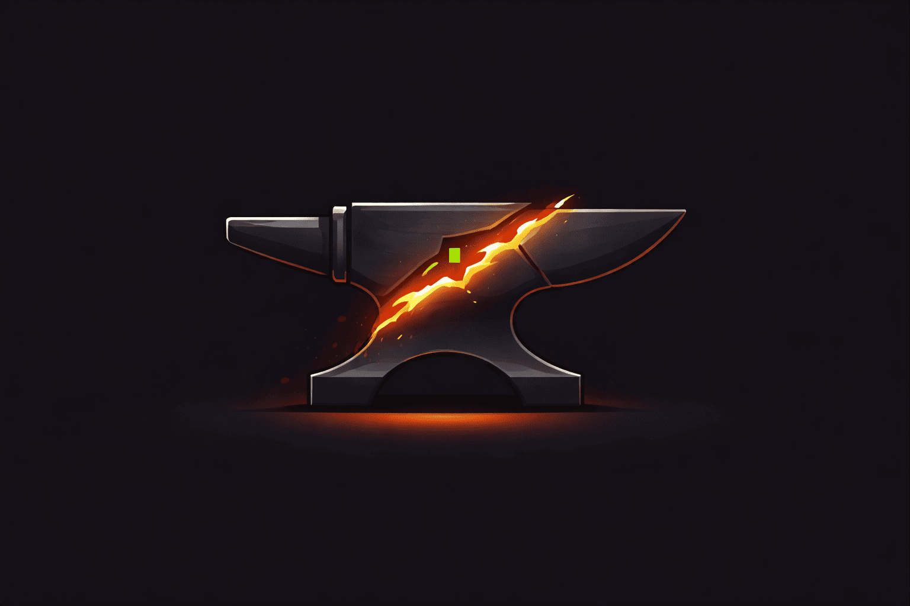

# not-my-reforge



*not oh-my. reforged.*

AI agent orchestration, quality hooks, and smart routing for Claude Code — reforged from oh-my-opencode and oh-my-claudecode.

## Install

```bash
claude plugin add https://github.com/speson/not-my-reforge
```

For the best experience (sidebar dashboard, parallel execution), run inside tmux:

```bash
tmux new-session "claude"
```

<details>
<summary>Local development</summary>

```bash
git clone https://github.com/speson/not-my-reforge
cd not-my-reforge && npm install && npm run build

# Run inside tmux for full feature support
tmux new-session "claude --plugin-dir ."
```

> **Note:** When developing this plugin itself, always use `--plugin-dir` to point at
> the local source. The installed version (`~/.claude/plugins/cache/...`) is a separate
> copy — edits to the repo won't take effect until you reinstall or use this flag.
> Using `--plugin-dir` also ensures hooks run against your latest build, avoiding
> stale-cache issues like the verification gate running outdated code.
</details>

## Quick Start

```bash
#orch implement auth, profiles, and notifications   # Smart orchestration
#deep refactor the authentication module             # Deep analysis (opus)
#quick what does this function do?                   # Fast answer (haiku)
#sec audit the API authentication layer              # Security scan
#score                                               # Quality score report
#trust                                               # Trust level status
/not-my-reforge:diff-review                          # 5-perspective review
#search UserService                                  # DeepSearch
```

## Orchestration Modes

8 modes — or let `#orch` auto-select:

| Mode | Command | Best For |
|------|---------|----------|
| **Ralph Loop** | `reforge loop <task>` | Iterative refinement until success |
| **Autopilot** | `reforge autopilot <goal>` | Sequential multi-task automation |
| **Pipeline** | `reforge pipeline <goal>` | Quality gates: plan → implement → verify → fix → review |
| **Team** | `reforge team N <task>` | Parallel workers + worktree isolation |
| **Swarm** | `reforge swarm <goal>` | Parallel research and analysis |
| **QA Loop** | `reforge qa <target>` | Auto test → fix → retest cycle |
| **Ralplan** | `reforge ralplan <goal>` | Iterative consensus planning |
| **Ultrawork** | `#ultrawork <task>` / `#uw <task>` | ALL agents in maximum parallel execution |

`#orch` routing:

| Pattern | Mode |
|---------|------|
| Multiple tasks (comma/and) | team |
| Multi-task + complex scope | ultrawork |
| "fix all" + test-related | qa |
| "fix all" / `--verify` | ralph |
| Analysis / research / audit | swarm |
| Design / plan / architect | ralplan |
| Quality-critical (payment, auth) | pipeline |

```bash
reforge cancel              # cancel all modes
/not-my-reforge:mode        # check active mode
```

## Agents

**20 Core** + **5 Team** agents:

| Agent | Model | Purpose |
|-------|-------|---------|
| `oracle` / `oracle-deep` / `oracle-quick` | sonnet/opus/haiku | Architecture analysis |
| `planner` / `planner-quick` | opus/sonnet | Implementation planning |
| `reviewer` / `reviewer-quick` | sonnet/haiku | Code review |
| `security-reviewer` | opus | Security audit (OWASP Top 10) |
| `build-fixer` | sonnet | Build error specialist |
| `designer` | sonnet | UI/UX design |
| `test-engineer` | sonnet | Test suite design, TDD |
| `analyst` | opus | Requirements decomposition |
| `critic` | opus | Plan evaluation |
| `explore` | haiku | Fast codebase exploration |
| `librarian` | sonnet | Documentation research |
| `vision` | sonnet | Screenshot/mockup analysis |
| `git-master` | sonnet | Git workflow, conflicts |
| `qa-engineer` | sonnet | Auto QA loop |
| `consensus-planner` | sonnet | Plan-critique-revise cycles |
| `deepsearch` | sonnet | Multi-strategy search |

Team agents: `lead`, `worker`, `researcher`, `tester`, `reviewer-teammate`

## Commands

| | Command | Purpose |
|---|---------|---------|
| **Workflow** | `quick` `deep` `visual` `review` `diff-review` `init` `deepinit` `handoff` | Task execution and project setup |
| **Orchestration** | `loop` `spawn` `autopilot` `pipeline` `team` `swarm` `qa` `ralplan` `ultrawork` | Multi-step automation |
| **DevOps** | `pr` `release` `status` `history` `mode` `notify` `doctor` | Git, metrics, diagnostics |

All commands prefixed with `/not-my-reforge:` (e.g. `/not-my-reforge:quick`)

## Keywords & Shortcuts

**Keywords** (type directly):

| Keyword | Effect |
|---------|--------|
| `reforge deep/quick <task>` | Model routing (opus/haiku) |
| `reforge review/analyze/critique/security` | Specialized analysis |
| `reforge parallel <task>` | Parallel subtask execution |
| `reforge ultrawork <task>` | Maximum parallel agents |
| `reforge cancel [target]` | Cancel active mode |

**Shortcuts** (`#` prefix, anywhere in prompt):

| Shortcut | Effect |
|----------|--------|
| `#orch [task]` | Smart orchestration — auto-select mode |
| `#ultrawork <task>` / `#uw` | ALL agents in parallel |
| `#deep <task>` | Deep opus-tier analysis |
| `#quick <task>` | Fast haiku-tier execution |
| `#search <query>` | DeepSearch (5 strategies) |
| `#review [base]` | Multi-perspective code review |
| `#sec [scope]` | Security audit (OWASP, CVEs) |
| `#analyze <goal>` | Requirements decomposition |
| `#critique <plan>` | Plan evaluation and critique |
| `#qa [target]` | Auto test-fix-retest loop |
| `#team` | Team agent status |
| `#score` | Quality score report |
| `#trust` | Progressive trust level |
| `#status` | Session metrics |
| `#memo [text]` | Session notes (`!` = critical) |
| `#verify` | Run all quality checks |
| `#help` | Full command reference |

Active shortcuts are displayed in the tmux sidebar dashboard.

## Hooks

45+ automatic hooks across 6 categories:

| Category | Hooks | Highlights |
|----------|-------|------------|
| **Safety** | write-guard, comment-checker, edit-safety, non-interactive-guard, intent-gate, mode-guard | Block overwrites, AI slop, destructive commands |
| **Verification** | verification-gate, todo-enforcer, deliverable-check | Quality checks on Stop |
| **Intelligence** | project-memory, learner, task-sizer, context-monitor, failure-tracker, directory-agent-injector, session-recovery | Auto-detect stack, learn patterns, circuit breaker, recovery |
| **Trust & Quality** | permission-bypass, trust-tracker | Progressive Trust (L0→L3), smart auto-allow, Quality Score tracking |
| **Orchestration** | ralph-\*, autopilot-\*, pipeline-\*, swarm-\*, cancel-handler, teammate-idle, task-completed | Mode lifecycle management |
| **Observability** | metrics-collector, subagent-tracker, hud-update, todo-tracker, notify-completion, session-\*, shutdown-protocol, code-simplifier | Tracking, notifications, cleanup |

## Progressive Trust

Session-scoped permission escalation — earns trust through successful operations:

| Level | Name | Auto-Approved | How to Reach |
|-------|------|---------------|--------------|
| 0 | Strict | Safe Bash, Read, .reforge/ writes | Default |
| 1 | Familiar | + Edit | 5 consecutive Edit/Write successes |
| 2 | Trusted | + Write, build/test commands | Build passes |
| 3 | Autonomous | + all non-destructive Bash | Tests pass |

Destructive commands (`rm -rf`, `git push --force`, `DROP TABLE`) are never auto-approved.
View status: `#trust`

## Quality Score

Weighted session health metric — view with `#score`:

| Component | Weight | Source |
|-----------|--------|--------|
| Edit Success Rate | 30% | successful edits / total edits |
| Build Health | 25% | last build pass/fail |
| Test Health | 25% | last test pass/fail |
| Code Cleanness | 20% | slop comment count |

## Skills

| Skill | Purpose |
|-------|---------|
| `project-awareness` (auto) | Tech stack detection and memory |
| `team-pipeline` | 5-stage quality pipeline with Agent Teams |
| `deepsearch` | Multi-strategy parallel codebase search |
| `code-audit` | 5-agent parallel security/quality/performance audit |
| `safe-experiment` | Worktree-isolated code experimentation |

## MCP Servers

Zero-config — bundled in `.mcp.json`, available automatically:

| Server | Purpose |
|--------|---------|
| [Context7](https://context7.com) | Library documentation lookup |
| [grep.app](https://grep.app) | Cross-repository code search |

## Notifications

```bash
/not-my-reforge:notify add discord <webhook_url>
/not-my-reforge:notify add slack <webhook_url>
/not-my-reforge:notify add telegram <bot_token>:<chat_id>
```

## Sidebar Dashboard

A tmux sidebar pane (40 cols) opens automatically on session start, showing 3 sections:

```
  not-my-reforge v2.4.0

  SHORTCUT
  ◆ ralph — Implement auth
  ⏱ 3m 22s

─────────────────────────────────────

  TODO
  ✓ 1. Setup auth module
  ◆ 2. Implement login flow
  ○ 3. Add tests
  ━━━━━━━━━━━━━━░░░░░░░░░░░░░░░  1/3

─────────────────────────────────────

  GIT DIFF
  3 files changed

  src/auth.ts                    +42
  src/hooks/login.ts          +8 -3
  tests/auth.test.ts            +15
```

- **Shortcut**: Active mode name, goal, elapsed time
- **Todo**: Real-time task progress (TaskCreate/TaskUpdate)
- **Git Diff**: Per-file insertions/deletions

Polls every 2s. Requires tmux — silently skipped outside tmux sessions.

## Parallel Execution

```bash
# tmux — shared workdir
bash scripts/tmux-spawn.sh "session" "task1" "task2" "task3"

# tmux — git worktree isolation
bash scripts/tmux-spawn-worktree.sh "session" "task1" "task2" "task3"

# Agent Teams (requires CLAUDE_CODE_EXPERIMENTAL_AGENT_TEAMS=1)
reforge team 3 implement auth, profiles, notifications
```

## Failure Playbook

Automatic error-type recovery suggestions injected on tool failure:

| Error Type | Example Pattern | Recovery |
|------------|-----------------|----------|
| TypeScript | `error TS2345` | Read type definition, check constraints |
| Test | `FAIL`, `Expected X Received Y` | Run failing test in isolation |
| Build | `Module not found` | Verify imports, check `npm ls` |
| Permission | `EACCES` | Check file permissions |
| Syntax | `Unexpected token` | Check brackets/commas near error line |

## Project Structure

```
not-my-reforge/
├── .claude-plugin/plugin.json   # Plugin manifest
├── .mcp.json                    # MCP server config (Context7, grep.app)
├── agents/                      # 25 agents (20 core + 5 team)
├── commands/                    # 24 slash commands
├── hooks/hooks.json             # 45+ hook definitions
├── skills/                      # 5 skills
├── scripts/                     # tmux, HUD, merge, find-node
├── src/hooks/                   # Hook implementations (TypeScript)
├── src/lib/                     # Shared libraries (trust, quality, playbook, ...)
├── dist/                        # Compiled JS (pre-built)
├── package.json
├── CLAUDE.md
├── .gitignore
└── README.md
```

## Requirements

- Claude Code CLI
- Node.js >= 18
- `tmux` (optional, for parallel execution)
- `git` (for worktree isolation)

## License

MIT
